# Cafeteria Management System

<a href="https://rubyonrails.org/"></a> <a href="https://www.pupilfirst.school/"></a> <a href="http://cafeteria-by-abhinandan.herokuapp.com/"></a>

---

This is a Cafeteria Management System built on Rails and supports multiple users and roles like admin, customer, and billing-clerk.

You can create menus, update menu items, see reports,...

## Deployed on [Heroku](http://cafeteria-by-abhinandan.herokuapp.com/)

### Admin Credentials

| **email**    | admin@admin.com |
| ------------ | --------------- |
| **password** | admin           |

[http://cafeteria-by-abhinandan.herokuapp.com](http://cafeteria-by-abhinandan.herokuapp.com/)

---

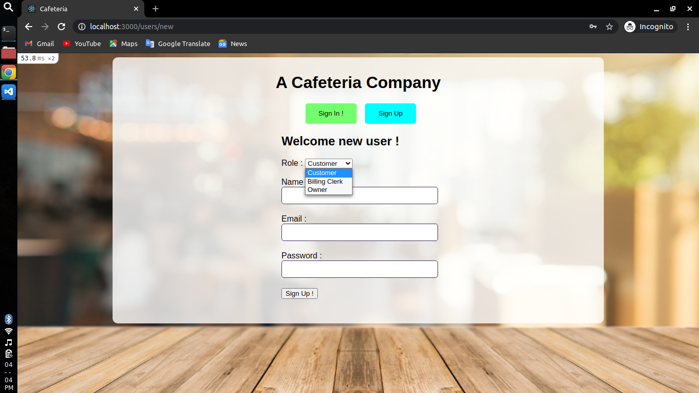
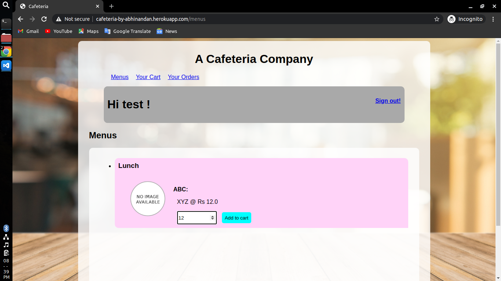
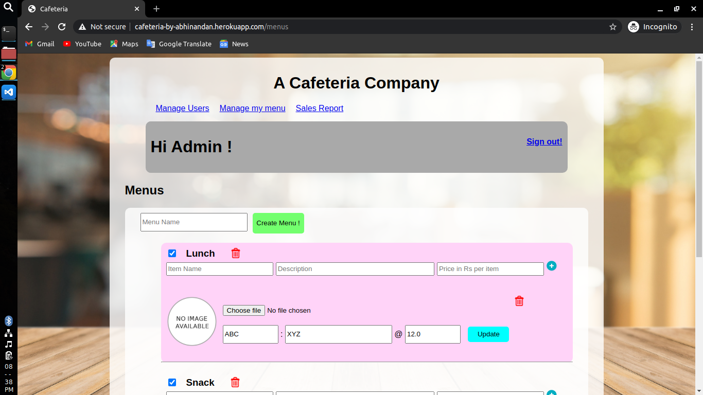
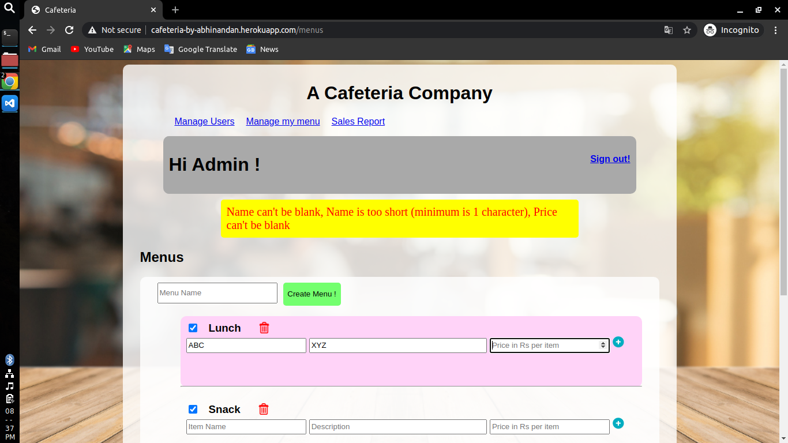
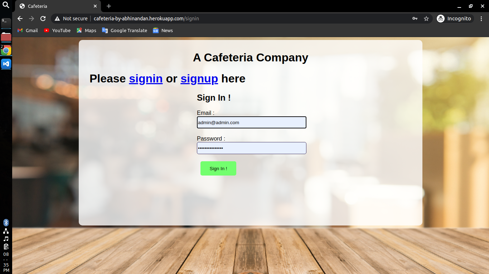
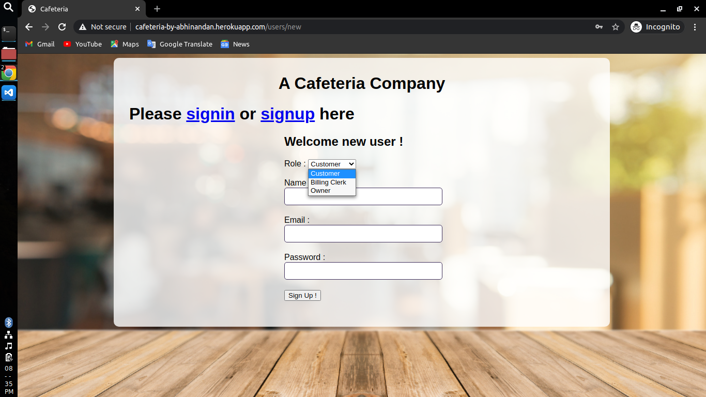
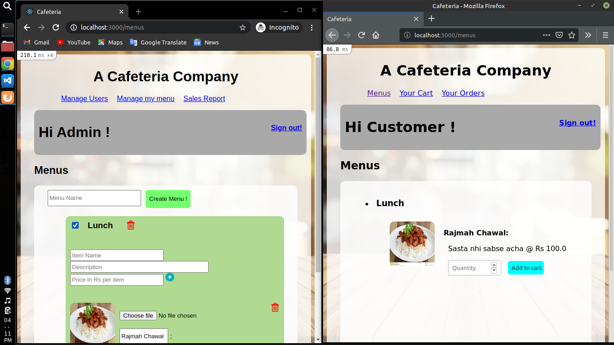
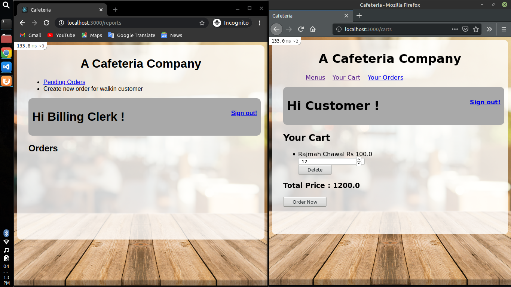
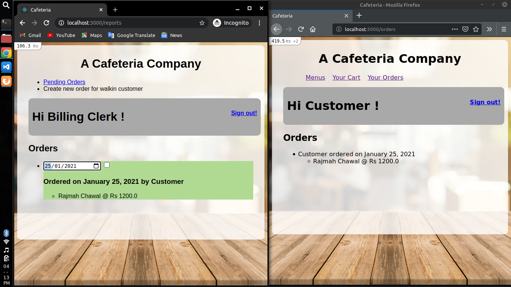
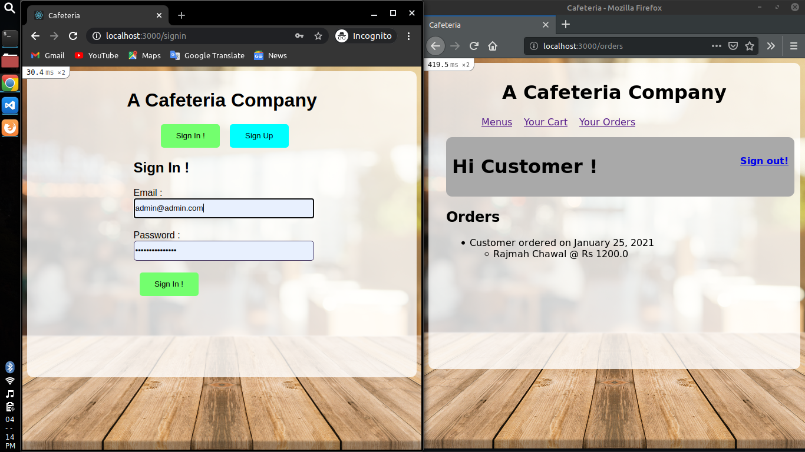
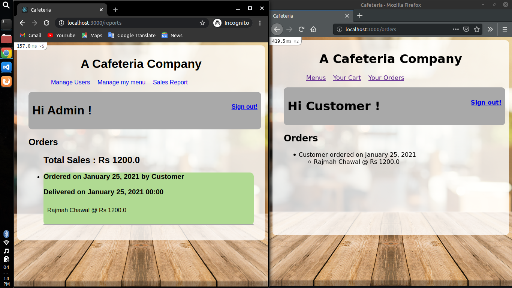
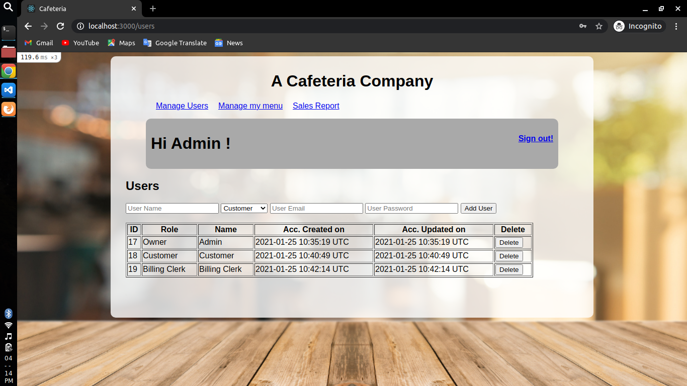

---

# User Guide

1. Watch the video in 1.5x speed
2. Turn on the caption

[](https://www.youtube.com/watch?v=3KHgxM-YLGI)

# Features

- **Owner**

  - can create menu, add menu items to menus, update menu, add item images, etc
  - can create users of customer, billing clerk and owner as well
  - can see sales report

- **Billing Clerk**

  - can see pending orders and mark them delivered based on datetime

- **Customer**

  - can see menus and corresponding menu items
  - can add items to their cart
  - can edit items quantity or delete items from cart
  - can place order based on items on cart

# Setup

1. Clone this repo and go to repo's directory using terminal
2. Create a file `recaptcha.rb` in `config/initializer` folder and add content as follows

```ruby
# config/initializer/recaptcha.rb
Recaptcha.configure do |config|
  config.site_key = "<SITE KEY>"
  config.secret_key = "<SECRET KEY>"
  # Uncomment the following line if you are using a proxy server:
  # config.proxy = 'http://myproxy.com.au:8080'
end
```

3. Deploy the project and run following commands

```
rails db:migrate
```

# Database Model

- `users`

  - `name`
  - `role`
  - `email`
  - `password` (password_digest)
  - `created_at`
  - `updated_at`

- `carts`

  - `user_id`
  - `menu_item_id`
  - `menu_item_name`
  - `menu_item_price`
  - `quantity`

- `orders`

  - `date`
  - `user_id`
  - `delivered_at`
  - `created_at`
  - `updated_at`

- `order_items`

  - `order_id`
  - `menu_item_id`
  - `menu_item_name`
  - `menu_item_price`

- `menus`

  - `name`
  - `active`

- `menu_items`

  - `menu_id`
  - `name`
  - `description`
  - `price`

- `active_storage` (for item image storage)
  - `image` belongs to `menu_items`

# Routes Defined

### Accessible publically

- `/` : Home Page
- `/signin` : Sign In Page
- `/users/new` : Sign Up Page

### Accessible to customer

- `/carts` : Cart Page
- `/menus` : Menu Page
- `/orders` : Order List Page

### Accessible to owner (admin)

- `/menus` : Editable Menu Page
- `/users` : Manage Users page
- `/reports` : Sales report Page

### Accessible to billing clerk

- `/reports` : Pending Orders Page
